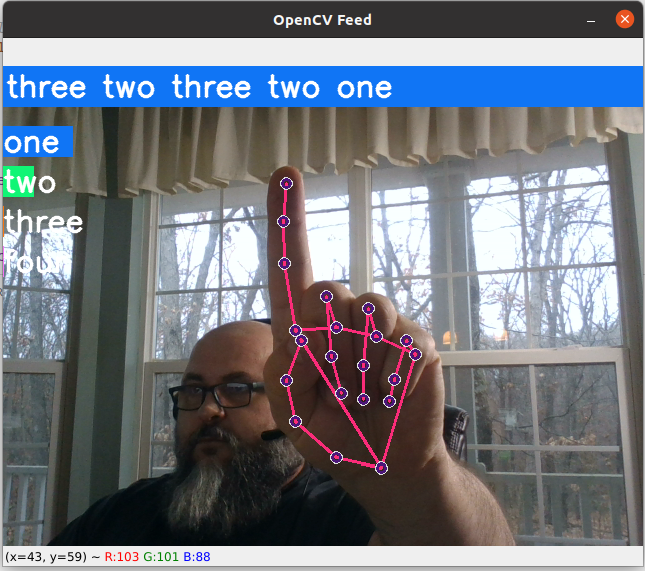
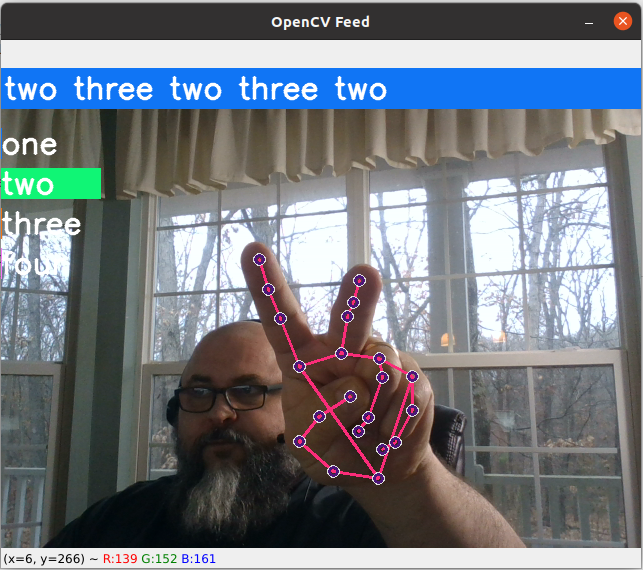

# Project Research Experiment

In the early stages of the project, it was not apparent if the STCV application should use a neural network trained to recognize sign language symbols. It was originally envisioned that the STCV project would use sign language to control the application. By using sign language, the user would not be required to touch a user interface.  Instead, computer vision would recognize commands and manage the application. 

Examples of training a neural network exist in plenty. For this project, the work of Nicholas Renotte was utilized.  Starting with Renotte's work, the project refactored his code to reduce the face, arms, and torso landmarks.  These items were removed to reduce the training load. This effort was successful, as can be seen in the following screenshots.

The neural network calculated probabilities of which sign language system was being displayed. Based on the highest probability, the sign language symbol was identified.  

In the end, while the neural networks were easily trained, the accuracy was not comparable to MediaPipe. MediaPipe provides the ability to recognize hands and landmarks assigned by MediaPipe with astonishing ease.  Further, the landmarks provided by MediaPipe provided a simple hand coordinate system that allowed the STCV to become more sophisticated than sign language training of the neural network easily allowed. Simply put, MediaPipe provides more capability with substantially less effort. 

Thus, the code in action_classification.py demonstrates computer vision and a neural network training of sign language, the code is not part of the end product. 