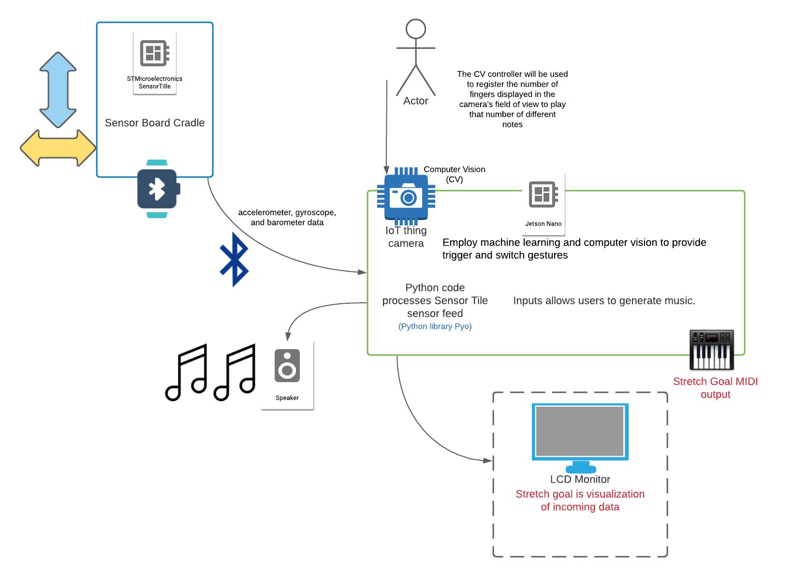

# Final Project Proposal

## Notes to keep in mind (DELETE BEFORE SUBMITTING)

* The project delivered should demonstrate the process of design, testing and proving the concept of the idea proposed.

## Title

STCV Synth

## Team members

* David Cardona
* Robert Fischer

## Motivation and literature research (inspiration on similar projects)

* [Genki Instruments - Wave](https://genkiinstruments.com/products/wave)
* [ReacTIVision](http://reactivision.sourceforge.net)
* [Embedded CSound on a BeagleBone or a Raspberry PI](http://www.csounds.com/journal/issue18/beagle_pi.html) (*Note that STCV Synth uses Pyo, but this is a reference in a lower-level language*)

## Reference Materials

* AI and CV:
    * [Tensorflow Object Detection in 5 Hours with Python | Full Course with 3 Projects](https://www.youtube.com/watch?v=yqkISICHH-U&t=211s)
    * [Sign Language Detection using ACTION RECOGNITION with Python | LSTM Deep Learning Model](https://www.youtube.com/watch?v=doDUihpj6ro&t=53s)

* Audio:
    * [Pyo Documentation](http://ajaxsoundstudio.com/pyodoc/index.html)
    * [Music and Human-Computer Interaction](https://hollis.harvard.edu/primo-explore/fulldisplay?docid=01HVD_ALMA512229392520003941&vid=HVD2&search_scope=everything&tab=everything&lang=en_US&context=L)

* NVIDIA Jetson Nano:
    * [NVIDIA Deep Learning Institute - Getting Started with AI on Jetson Nano Course](https://courses.nvidia.com/courses/course-v1:DLI+S-RX-02+V2/about)
    * [Raspberry Pi Module 2 Camera Setup](https://www.jetsonhacks.com/2019/04/02/jetson-nano-raspberry-pi-camera/)
    * [WiFi and Bluetooth Setup](https://www.jetsonhacks.com/2019/04/08/jetson-nano-intel-wifi-and-bluetooth/)
    
* SensorTile:
    * [UCLA ST IoT Curriculum](https://sites.google.com/view/ucla-stmicroelectronics-iot/home)

## Project category/categories

* Embedded Machine Learning application
* Embedded Data Algorithmic application
* Embedded Computer Vision Application
* Wearable Inertial Sensor Application
* Data Visualization and Data Analysis --> as data mapping to audio signals
* Real Time Data Visualization --> as data mapping to audio signals
* Gesture Recognition
* Human Activity Recognition
* Artificial Intelligence Application --> Training ML to create CV models
* Human Computer Interfaces --> Music Interaction
* General Event Detection Application

## Description

STCV Synth is a project that consists in controlling a music synthesizer DSP engine using the SensorTile (ST) and Computer Vision (CV). The synthesizer will have two main elements: a generator and controllers.

The generator is the DSP engine, which is built using the Python library Pyo or the C synthesizer CSound.

The controller elements are the ST and CV.

The ST will be sending continuous data to operate specific parameters of the synthesizer, such as amplitude and filter frequency. This data will most likely be obtained from the accelerometer, gyroscope, and barometer. The data will be transferred to the computer hosting the engine via BLE.

The host computer will also need a camera to run the CV controller, which will be used to register the amount of fingers displayed in the camera's field of view to play that number of different notes. Additionally, sign-language gestures wil be used as triggers to control special events for the synthesizers, such as turning DSP effects on and off, such as delays or reverbs.

The program will be able to be run from a computer or from an embedded system such as the NVIDIA Jetson Nano.

## Objectives

The project's objectives are to:

* Provide alternative ways of creative musical expression through the use of Wearables and Computer Vision
* Implement an audio synthesizer generator using the Python Pyo library, created by Olivier Bélanger.
* Setup controllers for interfacing with this generator, specifically:
    * Employ machine learning and computer vision to provide trigger and switch gestures.
    * Utilize SensorTile via BLE to provide continuous controller data.
* Run project on an embedded system, namely the NVIDIA Jetson Nano (4GB version), for portability

## Equipment Required

The required equipment includes:

* SensorTile:
    * [SensorTile Development Kit](https://www.st.com/en/evaluation-tools/steval-stlkt01v1.html)
        * *Note: Solder SensorTile to the Cradle board for operating it as a wearable*
    * [Nucleo-64 Development Board](https://www.st.com/en/evaluation-tools/nucleo-l476rg.html)

* NVIDIA Jetson Nano:
    * [NVIDIA Jetson Nano Dev Kit (4GB version)](https://developer.nvidia.com/embedded/jetson-nano-developer-kit)
    * Camera compatible with Jetson Nano, either:
        * [Logitech C270](https://www.logitech.com/en-us/products/webcams/c270-hd-webcam.960-000694.html)
        * [Raspberry Pi Module 2](https://www.raspberrypi.com/products/camera-module-v2/)
    * WiFi and Bluetooth:
        * [Intel Dual Band Wireless-Ac 8265 w/Bluetooth 8265.NGWMG](https://www.amazon.com/Intel-Dual-Band-Wireless-Ac-8265/dp/B01MZA1AB2/)
        * [RP-Style Antennas](https://www.amazon.com/CHAOHANG-RP-SMA-Antenna-Soldering-Wireless/dp/B01E29566W/)
    * [SD Card](https://www.amazon.com/gp/product/B07G3H5RBT/)
    * [5V 4W Barrel Jack Power Supply](https://www.adafruit.com/product/1466)
    * USB Audio Adapter or HDMI Decoder ***Note: Reference Pending***

* Note that it will be possible to run the program from a computer that allows for the software dependencies (see requirements.txt or README.md), and that has a camera.

# Diagram of the proposed architecture

The following diagram demonstrates the components:

## Proof of Concept or Minimum Value Product

## Final Project Deliverable

## Workplan with a milestone for each week

| Week |    Date      | Deliverable                                       |
| ---: |    :----:    | :----                                             |
| 1    | Oct 12, 2021 | Project Proposal                                  |
| 2    | Oct 19, 2021 | Ensure Pyo runs on Nano *if not, consider CSound* |
| 3    | Oct 26, 2021 | Implement and parse BLE GATT in real-time         |
| 4    | Nov  2, 2021 | Auto-Connect to ST via BLE upon launching script  |
| 5    | Nov  9, 2021 | Find ST ranges that are relevant to the synth     |
| 6    | Nov 16, 2021 | 
| 7    | Nov 23, 2021 |
| 8    | Nov 30, 2021 |
| 9    | Dec  7, 2021 |
| 10   | Dec 14, 2021 | Final Deliverable 
