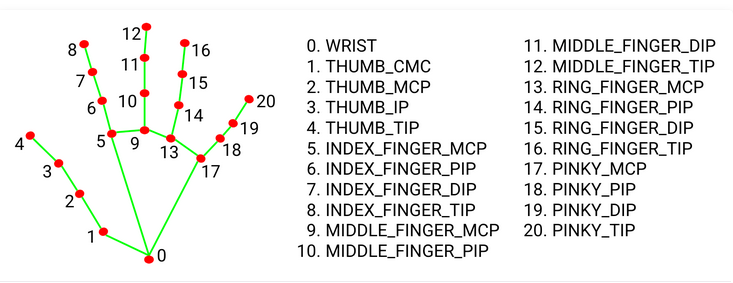
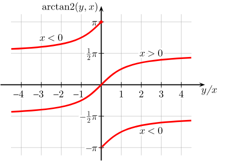
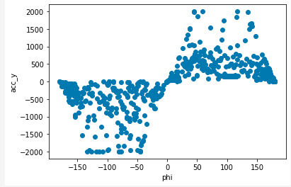
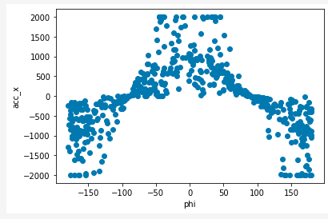
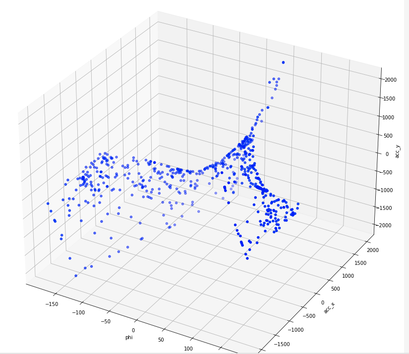
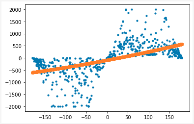
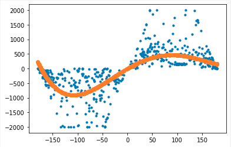
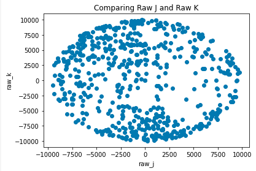
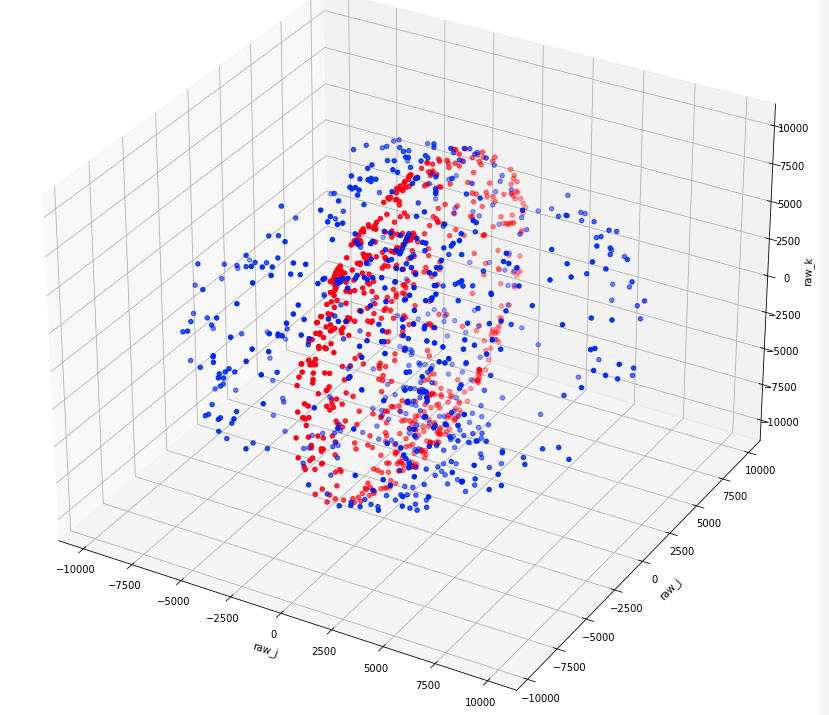

# Abstract

The STCV-Synth is the first prototype in a series of devices designed to bring creative opportunities to people with disabilities. Additionally, these devices seek to provide novel mechanisms for creating interactive art performances.

Specifically, the STCV-Synth is a music synthesizer made up of two main components, the engine and the controllers. The engine is implemented in Pyo, a Python audio DSP library. The controllers that operate and instruct the behavior of the engine are the SensorTile, by STMicroelectronics, and Computer Vision.


# Introduction

People with disabilities have a limited range of opportunities to express themselves creatively. Depending on the severity of any given condition, the priorities surrounding these individuals revolve around ensuring that their basic survival needs are met, including nutrition, hydration, medical care, and overall comfort. However, the quality of life of a person entails numerous aspects that go beyond these basic needs. Creative expression and communication can bring a lot of fulfillment to a person's life, and in often cases, there are prominent obstacles that prevent people with disabilities from manifesting their artistic creativity.

We aim to bring accessible and effective mediums for any individual to have access to creative expression. Using alternative controllers, such as wearable devices and computer vision, brings an array of possibilities that simplify creative endeavors. We set out to design a music synthesizer operated by both of these devices to turn general motion into musical events. We hope that interactions with our design will bring people joy and ease in what may potentially be a difficult time in their lives. We aim to contribute our grain of sand to the bettering of the lives of few or many.

We named our invention the STCV-Synth, since it is a synthesizer operated by a SensorTile (ST), by STMicroelectronics, and computer vision (CV). The combination of these devices result in performance approaches analogous to performing an orchestra. These controllers are capable of converting general movement into musical expression, and although we have an intended method of use in mind, we are excited to find what new approaches the performers of our invention will come up with.


# Demo Videos

* [Performance – Short Demo](https://www.youtube.com/watch?v=4_abwXvLJU0)

* [Rundown](https://www.youtube.com/watch?v=CzRnUWZmRmQ)


# Design

In this section we have outlined our efforts and explorations towards designing our synth and our controllers, emphasizing findings, obstacles, and conclusions.


## Synthesizer Engine

We developed the engine in charge of generating the audio using `pyo`, a Python audio DSP library developed by Olivier Belanger, containing abstractions that successfully emulate the components that make up an audio synthesizer, including oscillators, filters, envelope generators, signal mixers, audio effects, digital audio device selectors, and other useful utilities.

The library and the documentation are very straight-forward and a lot of experimentation was performed with the selection of various audio generators (i.e., oscillators), filters, and audio effects.

The final engine architecture is contains:
* 1 sawtooth wave oscillator.
* 1 4th-order (24dB per octave) low-pass filter.
* 1 ADSR (attack-decay-sustain-release) envelope generator.
* 1 digital audio mixer.
* 1 digital long-delay.
* 1 algorithmic reverb.

However, we encountered some difficulties at the time of getting Pyo to select the correct audio drivers in Linux. After extensive exploration, we discovered that the solution was instruction Linux to select the *default* audio device upon launching the Pyo audio server. Although this brought a solution, we still wanted to be able to automate this process. We directly wrote a GitHub issue, and Mr. Belanger pointed us towards some Pyo functions that would automatically choose the default audio device. This allowed us to programmatically select the adequate audio device for the performance, hence automating the whole audio server initialization routine.


## SensorTile

Implementing the SensorTile included extensive studies and experimentation with the provided ALLMEMS version 3.1 firmware. Incorporating the SensorTile was also filled with a variety of challenges. Overcoming these challenges was essential for the proper incorporation of the controller. The results were incredibly effective, and we discovered powerful interactions between the sensor and the synthesizer. In particular, accelerometer data converted into spherical coordinates was the most intuitive way to process and control parameters.


### BLE Connectivity, GATT Characteristics, and Sample Rates

The first big challenge was to accurately transfer data from the SensorTile into the custom Python software. We attempted implementing the _pygatt_ library, but unfortunately this library only implements the Linux BlueZ backend, which prevented cross-compatibility. Exploring available libraries, we came across _bleak_, which is a powerful cross-platform library that permits BLE communication using various Bluetooth backends for Windows, MacOS, and Linux. It was written and developed by Henrik Blidh.

Our explorations with _bleak_ were done alongside with Alvaro Ramirez, another DGMD-E14 student. Together, we discovered what every available charac


### asyncIO


### Automation


### Data Mapping


## Computer Vision 

The use of computer vision has always been a requirement STCV project. A user interface that does not require touch to control a fundamental component of the application. However, what was not know at the project's inception was what form the computer vision would take.


### Project Research Experiment

In the early stages of the project, it was not apparent if the STCV application should use a neural network trained to recognize sign language symbols. It was originally envisioned that the STCV project would use sign language to control the application. By using sign language, the user would not be required to touch a user interface.  Instead, computer vision would recognize commands and manage the application. 

Examples of training a neural network exist in plenty. For this project, the work of Nicholas Renotte was utilized.  Starting with Renotte's work, the project refactored his code to remove the face, arms, and torso landmarks that his design made use of. (Renotte, 2021) These items were removed to reduce the overall training load. This effort was successful, as can be seen in the following screenshots.


The neural network calculated probabilities of which sign language system was being displayed. Based on the highest probability, the sign language symbol was identified.  

```python
 model = Sequential()
    model.add(LSTM(126, return_sequences=True, activation='relu', input_shape=(30, 126)))
    model.add(LSTM(64, return_sequences=True, activation='relu'))
    model.add(LSTM(64, return_sequences=False, activation='relu'))
    model.add(Dense(64, activation='relu'))
    model.add(Dense(32, activation='relu'))
    model.add(Dense(actions.shape[0], activation='softmax'))

    model.compile(optimizer='Adam', loss='categorical_crossentropy', metrics=['categorical_accuracy'])
    model.fit(X_train, y_train, epochs=EPOCHS, callbacks=[tb_callback])

```

(Renotte, 2021)


In the end, while the neural networks were easily trained, the accuracy was not comparable to MediaPipe. MediaPipe provides the ability to recognize hands and landmarks assigned by MediaPipe with astonishing ease.  Further, the landmarks provided by MediaPipe provided a simple hand coordinate system that allowed the STCV to become more sophisticated than sign language training of the neural network easily allowed. Simply put, MediaPipe provides more capability with substantially less effort. 

Thus, the code in action_classification.py demonstrates computer vision and a neural network training of sign language, the code is not part of the end product. The fitting and predictition developed reasonable results but still fell short in that following ways.  


### False Results

When using a trained model, the developed algorithm determines the most probable label from the set of labels found in the data.  However, what happens when there is no actual label condition present? In those cases, the training would still attempt to make predictions.  While this scenario could have relieved additional programming, the situation was entirely bypassed with MediaPipe. If there were no hands present in the computer vision field of view, false positives were almost completely avoided


### Significant Training Costs

Google trained MediaPipe trained with a dataset larger than anything the STCV application could accomplish. "To obtain ground truth data, we have manually annotated ~30K real-world images with 21 3D coordinates..." (Google, LLC, 2020). For the project research, code was written to assist in the capturing of images to build model training data.  This work required time and patience since the quality of the images had to be suitable as exemplars.  Early results indicated that building model training data would be time-consuming without yielding a superior product to MediaPipe.   


## MediaPipe Computer Vision

With MediaPipe, hand landmarks are easily identified. The MediaPipe abilities were discovered as a result of the neural network training. Renotte makes use of MediaPipe to extract the landmarks into NumPy arrays that are then submitted to fitting and prediction.  MediaPipe provides "precise keypoint localization of 21 3D hand-knuckle coordinates inside the detected hand regions via regression, that is direct, coordinate prediction." (Google, LLC, 2020) Direct, coordinated predication allowed the project to recognize finger movements exactly. MediaPipe provided for specific finger identification. Once the application could identify finger positions precisely, the application could then substitute the touch interface for a computer vision interface.

 (Google, LLC, 2020)

Using MediaPipe and combined with OpenCV for Python provided for basis for a touchless user interface. 


## Graphical User Interface

Computer vision forms the basis of the user interface. The user interface makes use of two primary libraries: MediaPipe and OpenCV.  OpenCV is the rendering platform for all user controls. The visual interface of visual controls that are rendered on the screen to provide the grahical interface. These controls are not accessed via mouse and keyboard, but virtually through computer vision. All user controls were created by this project team, since the project is unaware of any applicable OpenCV controls that could adapted to this project. That is not to say that OpenCV does not have user interface controls as part of the library, it does.  Those controls did not meet the project requirements.

The following is an example of the __init__ function for a user interface class written for the project. As seen below, the parameters of the class define the user interface.

```python
class PlusMinusButtons:
    """
    Base Class for Button-based GUI elements.
    """
    def __init__(
        self, x: int, y: int,
        label: str = "Label", label_offset_x: int = 50,
        min_value: int = 1, max_value: int = 100,
        text_color: Tuple[int, int, int] = (255, 255, 255),
        btm_text_color: Tuple[int, int, int] = (4, 201, 126),
        back_color: Tuple[int, int, int] = (255, 255, 255),
    ) -> None:

        # Screen Coordinates.
        self.x1 = x         # Left
        self.y1 = y         # Top
        self.x2 = x + 50    # Right (Length)
        self.y2 = y + 50    # Bottom (Height)

        # Button Design.
        self.label = label                              # Button Label
        self.text_color = text_color                    # Text color for label
        self.btm_text_color = btm_text_color            # Text color for botton
        self.back_color = back_color                    # BG color
        self.label_offset_x = self.x1 + label_offset_x  # Distance from button

        # Create a bounding boxes to detect collisions against the buttons.
        self.minus_bounding_box = create_rectangle_array(
            (self.x1, self.y1), (self.x2, self.y2)
        )
        self.plus_bounding_box = create_rectangle_array(
            (self.x1 + 100, self.y1), (self.x2 + 100, self.y2)
        )

        # Set range of GUI element.
        self.min_value = min_value
        self.max_value = max_value

```

These settings then drive the rendering of the control using OpenCV method calls. 

```python
    def render(self, img):
        # Create the minus button rectangle.
        cv2.rectangle(
            img, (self.x1, self.y1), (self.x2, self.y2),
            self.back_color, cv2.FILLED
        )

        # Add the 'minus' sign text.
        # The order of drawing sets the display order.
        cv2.putText(
            img, "-", (self.x1 + 12, self.y1 + 35),
            cv2.FONT_HERSHEY_SIMPLEX, 1, self.btm_text_color,
            2, cv2.LINE_AA
        )

        # Create the plus button rectangle.
        cv2.rectangle(
            img, (self.x1 + 100, self.y1), (self.x2 + 100, self.y2),
            self.back_color, cv2.FILLED,
        )

        # Add the 'plus' sign text.
        cv2.putText(
            img, "+", (self.x1 + 112, self.y1 + 35),
            cv2.FONT_HERSHEY_SIMPLEX, 1, self.btm_text_color,
            2, cv2.LINE_AA
        )

        # Draw the label of the control.
        cv2.putText(
            img, self.label, (self.label_offset_x, self.y2),
            cv2.FONT_HERSHEY_SIMPLEX, 1, self.text_color,
            2, cv2.LINE_AA
        )

        # Draw the currently selected value
        cv2.putText(
            img, str(self.value), (self.x2 + 150, self.y2),
            cv2.FONT_HERSHEY_SIMPLEX, 1, self.text_color,
            2, cv2.LINE_AA
        )

        # Return drawn controls overlaid on the image.
        return img

```

Thus, the graphical user interface classes hold the configuration parameters and define the rendering logic that OpenCV provides the image on which these controls are rendered. How then do user actions reach the logic of the application? The answer is MediaPipe. 

MediaPipe provides landmark tracking of hands.  As discussed above, MediaPipe gives precise coordinates of each landmark point in a hand. As such, MediaPipe made it simple to do away with a mouse and keyboard for some operations.  

Given that the application drew user controls, it meant that the boundaries of each control was already known.  To determine if the user was interacting with the controls meant simply running the calculations to see if the index finger control the application had fallen within the boundaries of the user control.  The logic for this was trivial, as seen in the following code from _cv_screen.py_.

```python
        def minus_btn_check_collision(self, x: int, y: int) -> Union[bool, None]:
        """
        Processes events for the minus botton collision (i.e., the
        intersection between a finger landmark and the button).
        """
        # Ensure that decreasing the value would not exceed minumum.
        if self.min_value < self.value:
            point = Point(x, y)
            # Decrease value if there was a collision.
            if point_intersects(point, self.minus_bounding_box):
                self.set_value(self.value - 1)
                return True

```


## Data

As part of the programming, logging code was developed to capture all data specific to the data received from the sensor tile. This code tracked data such as acceleration, magnitude, Euler angles, and other items.  The data exists under the project root in the folders _analysis->renderExamples_.  Two files, dorian_bpm100_00_motion.csv and A_dorian_bpm100_06_quaternions.csv, are examined in more depth via Python notebooks.

It is also possible to log environmental data by uncommenting the following lines in `main.py`: 96, 97, 123, 124, 125, 250, and 251. This data was not logged nor analyzed in our final submission as we found that environmental data was not as sensitive nor as informative at the time of mapping data to the synth, nor applying data analysis algorithms.

In addition to these .csv files, the synthesizer engine captures .wav files of every execution of the performance. These files are included in the _render_ folder that will be created at the STCV-Synth root directory after the first execution.


## Data Analysis

The project logged application data for the purpose of analysis.  An analysis is presented in the notebooks _stcv_linear_regressiondorian_bpm100_00_motion.ipynb_ and notebook_A_dorian_bpm100_06_quaternions.ipynb. The data studied the data produced by the sensor tile for two different perspectives. 

The purpose behind the analyis was to determine the difficulties that might be encounters should the project again attempt to apply machine learning to the applications problem sets. In our numerical experimentations we focused on two main areas, Euler Angles and Quaternion input and outputs. 


### Euler Angles

The first perspective found in stcv_linear_regressiondorian_bpm100_00_motion.ipynb looks at the data from using Euler angles to track motion. Euler angles, while simple to understand and computer, seem to create problems from a mathematical perspection.  In part, this difficulty comes from the trignometric identities used to compute Euler Angles.  Given that the computation of roll, pitch, and yawl in the calculations of $phi$ that creates interesting difficulties. The difficulties arise from the use of the arctan function.

$$
\phi = \arctan \left(\frac{acc_y}{acc_x}  \right)
$$

The input and output of arctan look as follows:



(Wikimedia Foundation, Inc, 2021)

When viewed in three dimensions, the graph appears as follows:


Obviously, the output of arctan, arctan2 was used in the python code, is nonlinear. Hence, the value of applying linear regression to components of Euler Angles will yield difficulties in fitting data. And indeed, that was seen in the calculations of linear regression.  These calculations are presented in _stcv_linear_regressiondorian_bpm100_00_motion.ipynb_ 

Within that notebook, the data operations begin with investigating correlations from a general sense. The approach was the no assumptions were made about the relationships with the data. Starting with data features with the highest correlations, several graphs were made demonstrating the relationships.







It is with these graphs that the underlying functions that is nonlinear can be visualized. Nor would a clustering analysis lead to a proper conclusion.  Hence, the data graphs provide significant insight into the data realities produced by the sensor tile. So given that Euler angles include nonlinear functions, it is now known that the use of Euler angles can be approximated with linear regression with any accurate accuracy.  For example, assuming a second-degree polynomial versus a fourth-degree polynomial does not significantly improve the performance of linear regression. 





It was determined that the use of Euler angles posed significant challenges for linear regression. The best R-squared for training set using a fourth-degree polynomial was: 0.5315. These results are documented in stcv_linear_regressiondorian_bpm100_00_motion.ipynb in the _analysis_ directory.


### Quaternions

The project also experimented with quaternions. Compared with Euler angles, linear regression proved much more successful, although the experiments were not the same. The experiments were different because quaternions act much differently than Euler angles, even though they can describe the same actions. 

The principal investigation of quaternions appear in the notebook _notebook_A_dorian_bpm100_06_quaternions.ipynb_. The investigation demonstrates that quaternions can be more readily used with linear regression. In fact, experiments demonstrate a possible R-squared for training set of 1.0000 when using a third degree polynomial. 

Fundamentally, graphs of the project data show a fundamental data structure 
that differs from Euler angle actions, as seen in the following graphs. 



A complete investigation can be reviewed in _notebook_A_dorian_bpm100_06_quaternions.ipynb_.


## NVIDIA Jetson Nano


# Conclusions


# References

Lee, W.-M. (2019). Python Machine Learning. Wiley.

Bélanger, O. (n.d.). Pyo 1.0.4 documentation. AJAX SOUND STUDIO. http://ajaxsoundstudio.com/pyodoc/

Renotte, N. (2021, June 19). Sign Language Detection using ACTION   RECOGNITION with Python | LSTM Deep Learning Model. YouTube. Retrieved December 17, 2021, from https://www.youtube.com/watch?v=doDUihpj6ro
